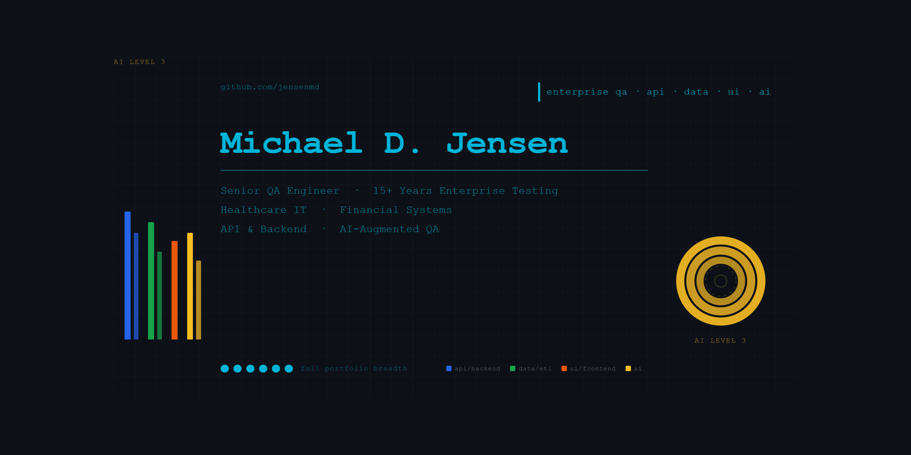

# Michael D. Jensen — Senior QA Engineer

15+ years of enterprise software testing experience across healthcare IT, financial systems, telecommunications, and cybersecurity. Deep background in REST API validation, ETL pipeline testing, SQL-based data integrity verification, and full-stack manual testing in Agile environments.

Currently re-entering the field with active focus on Python/pytest automation, Playwright UI testing, and CI/CD-integrated quality practices.

🔗 [LinkedIn](https://www.linkedin.com/in/michaeljensen-qa/) | 🐙 [GitHub Profile](https://github.com/jensenmd) | 📧 [jensen.md@gmail.com](mailto:jensen.md@gmail.com)

---

## Portfolio Projects

| Project | What It Demonstrates |
|---|---|
| [claude-code-qa-sessions](https://github.com/jensenmd/claude-code-qa-sessions) | Claude Code applied to existing QA repos — agentic analysis, human-in-the-loop validation |
| [pharmacy-spend-etl-qa](https://github.com/jensenmd/pharmacy-spend-etl-qa) | ETL pipeline validation, SQL-driven data integrity testing |
| [qa-automation-showcase](https://github.com/jensenmd/qa-automation-showcase) | REST API testing, data validation, CI/CD integration |
| [restful-booker-qa](https://github.com/jensenmd/restful-booker-qa) | Full-stack layered testing — API + UI automation |
| [ai-qa-framework](https://github.com/jensenmd/ai-qa-framework) | AI-assisted test generation, human-in-the-loop validation |

---

## Portfolio Visual Key

Each project graphic uses a consistent visual encoding system. Here's how to read it:

### Bar Color — Testing Layer
Each bar color represents a distinct testing layer present in the project:

| Color | Testing Layer |
|---|---|
| 🔵 Blue | API / Backend / Services |
| 🟢 Green | Data / ETL / SQL |
| 🟠 Orange | UI / Frontend / Browser |
| 🟣 Purple | Infrastructure / Platform |
| 🟡 Gold | AI — always reserved for AI involvement |
| 💠 Cyan | Profile banner only — never on individual projects |

### Bar Height & Width — Depth and Coverage
- **Bar height** = depth of testing within that layer (taller = deeper validation, more edge cases, business rules)
- **Bar width** = volume of test coverage (wider = more tests, broader coverage)
- **Number of bars** = number of distinct system layers under test

### The 6 Dots — Testing Disciplines Present
| Position | Discipline |
|---|---|
| Dot 1 | Manual / functional testing |
| Dot 2 | API testing |
| Dot 3 | Data validation |
| Dot 4 | UI automation |
| Dot 5 | CI/CD integration |
| Dot 6 | AI involved (triggers AI ring) |

A filled dot means that discipline is present. Dot 6 filled means an AI ring will appear alongside the graphic.

### AI Ring — AI Involvement Level
When Dot 6 is filled, an AI ring appears indicating the depth of AI involvement:

| Ring Level | Meaning |
|---|---|
| Level 1 — outer ring | AI assisted development |
| Level 2 — second ring | AI in live testing workflow |
| Level 3 — third ring | AI as autonomous agent (Claude Code) |
| Level 4 — fourth ring | AI orchestrating AI |
| Level 5 — core | Fully autonomous pipeline |

Rings fill from outside in — AI moving toward the core. Hollow rings represent future levels not yet reached.
